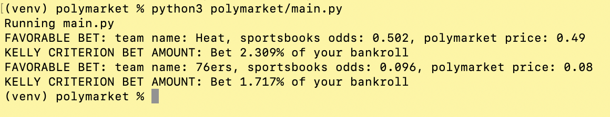

# polymarket
Automated betting system for NBA games on polymarket using the kelly criterion
and vig adjusted sports market odds.

Simply, find favorable NBA bets on polymarket and place an optimal bet on them.

## Description

My idea is this:

All NBA games have extensive odds from a multitude of bookmakers. If we compile those odds into an
average, we should get a rough idea of what the true odds of the game are. We then take those true 
odds and input them into polymarket to see if there are any favorable bets for us on that site.
We place these bets optimally using the kelly criterion.

## To Use

#### Dependencies
Must have a The Odds API account and key as well as a polymarket account

#### Installing
1. Clone the repository
2. Fill out the envtemplate with your information
3. save template as .env

#### Modifying the code
This code was all written for NFL regular season games. Since that is over,
I have modified it to work with NBA games to show functionality.

#### Running the code
1. create a virtual env
```bash
python3 -m venv venv
```
2. activate the virtual env
```bash
source venv/bin/activate
```
3. install the requirements
```bash
pip install -r requirements.txt
```
4. uncomment line 113 in main.py (if want to place bets on polymarket)
5. run polymarket/main.py (set this up to run daily)
```bash
python3 polymarket/main.py
```

## Demo
The code will print off something like:

(if there are any favorable bets today)

Hopefully this output is easily decipherable and you now know what bets to place! If you have a PolyMarket account linked, it will automatically place these bets for you depending on what amount you set as your bankroll.

## Journey
I created this trading bot for two reasons
1. I was fascinated by decision markets such as polymarket
2. I thought it would be a fun way to learn how to use APIs effectively

#### Impact
Ideally, as all trading bots do, this would provide more liquidity to polymarket and push
the markets closer to their true odds (the goal of decision markets).

#### New Tech
Prior to this project, I had never coded anything in python with APIs. It was fun for me to explore how to use them
and what the buzzword really was.

#### Challenges
Many, many, many.

1. Polymarket is rather new and their API is not well developed, hard to fish out exact games I wanted to bet on
2. Struggled finding sportsbook odds

## Author
Jack Beecher - jackbee0221@gmail.com

